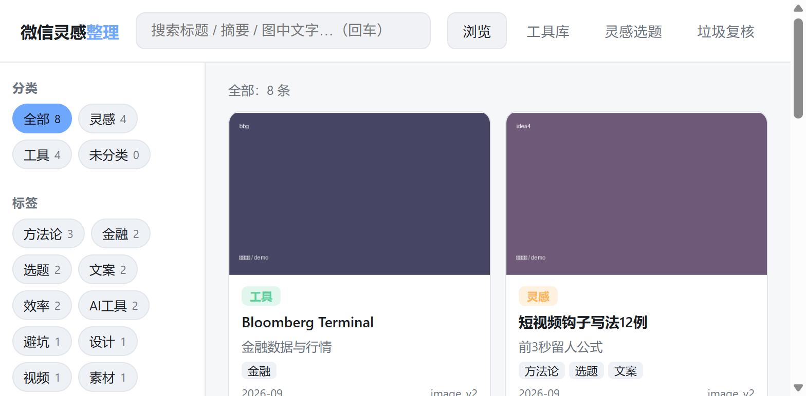
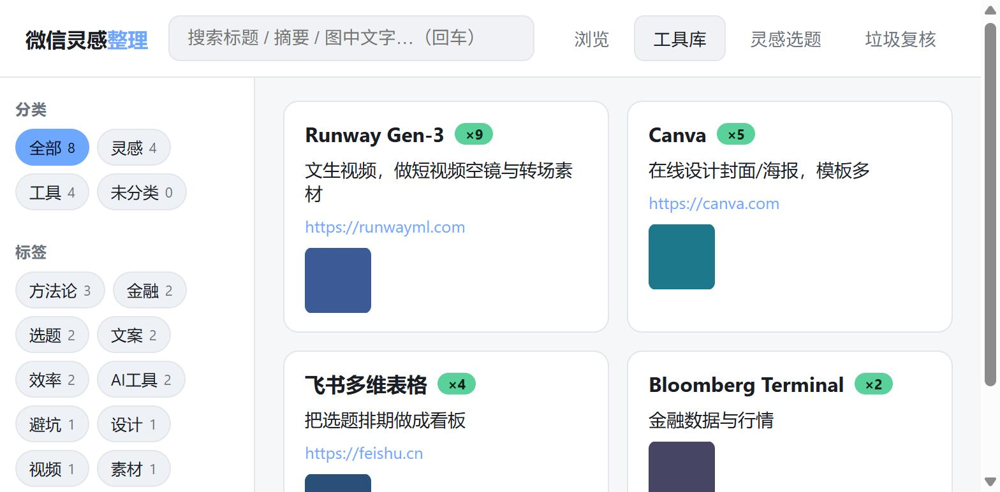

# 微信灵感整理 · wechat-inspiration

把长期发到**微信「文件传输助手」**（或任意私聊）里的灵感、工具截图、文字、链接，
自动读取并整理成一个**可浏览、可搜索、可沉淀**的本地知识库。纯本地运行，原始文件只读。

> Read the pile of ideas & tool screenshots you keep sending to WeChat's
> "File Transfer" and organize them into a searchable, self-hosted knowledge
> base — fully local, read-only on your original data.

## 界面预览

> 下图为**演示数据**，不含任何真实个人内容。

**浏览 + 搜索**：按 灵感/工具/标签 筛选，搜索标题、摘要、图中文字。



**工具库**：同一工具多次出现自动合并成一张卡（名称·出现次数·用途·官网·来源截图）。



## 为什么做这个

很多人习惯把灵感、看到的好工具、文章链接随手发给微信文件传输助手，日积月累
几千条，再也翻不到、用不上。MuseBox 把这堆东西：

- **解码 & 汇集**：老格式截图自动 XOR 解码；新版加密图 / `.wxgf`(HEVC) 也能接入。
- **去重**：文件哈希精确去重 + 感知哈希(pHash)去掉近似重复图。
- **本地 OCR**：把截图里的文字抠出来，可搜索（RapidOCR，离线免费）。
- **AI 分类**：用 DeepSeek 判成 `灵感 / 工具 / 垃圾`，自动生成标题、摘要、标签、
  工具名与官网链接；垃圾（付款/闲聊/验证码）不入库但可复核召回。
- **沉淀**：SQLite 存储，网页界面浏览搜索；同一工具多次出现自动合并成一张卡。

## 界面

启动后浏览器打开 `http://127.0.0.1:8756`，四个页签：

| 页签 | 作用 |
|---|---|
| 浏览 | 按 灵感/工具/标签 筛选，搜索标题/摘要/**图中文字** |
| 工具库 | 去重合并的工具卡（名称·用途·官网·来源截图）|
| 灵感选题 | 选一个标签，让 AI 把这些灵感归纳成可创作的内容选题 |
| 垃圾复核 | 被判为垃圾的内容，可一键「其实有用」召回 |

## 快速开始

```bash
pip install -r requirements.txt
cp config.example.json config.json     # 改成你自己的路径
cp secrets.example.json secrets.json   # 填入 DeepSeek API key（可选）

python -m src.run ingest      # 本地导入：解码 + OCR + 去重 + 入库（不需联网）
python -m src.run classify    # AI 分类（需 secrets.json 里的 key）
python -m src.run serve       # 启动网页界面
```

Windows 用户可直接双击 `启动灵感库.bat` / `更新导入.bat`。
**没有 key 也能用**：浏览、搜索、看图、去重都正常，只是没有自动分类和标签。

## 数据从哪来

MuseBox 本身**不解密微信数据库**——它消费已经解密/导出好的明文：

- **文字**：私聊导出的 `txt`（`时间  谁: 内容` 格式）。
- **图片**：老格式 `.dat` 本项目自解；新版加密图 / `.wxgf` 由你的导出工具解出后接入。
- **相册补充**：把手机截图丢进 `inbox/album/` 即可。

配置见 `config.example.json`（`sources` 段）。默认只整理「文件传输助手」，
可在 `sources.contacts` 加入其它联系人。

## 技术栈

Python · FastAPI · SQLite · RapidOCR(本地中文) · Pillow · imagehash ·
imageio-ffmpeg(转码 `.wxgf`) · DeepSeek API

## 隐私

- 全程本地。唯一对外请求是 DeepSeek 分类调用（发送 OCR 文字与文字消息）。不填
  key 则完全离线。
- API key 仅从本地 `secrets.json` 读取，不打印、不入库、不进日志、不进 git。
- 识别到的疑似密钥/token 会在入库前自动脱敏。
- 原始微信目录只读，绝不修改删除。

## 许可

MIT
